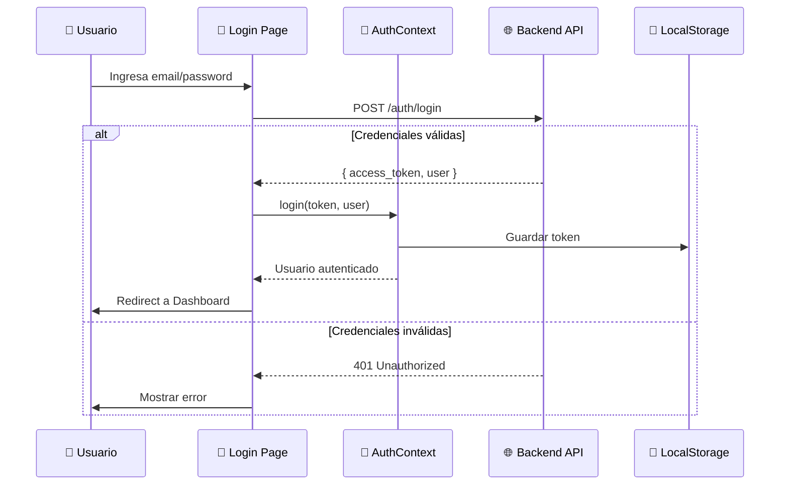
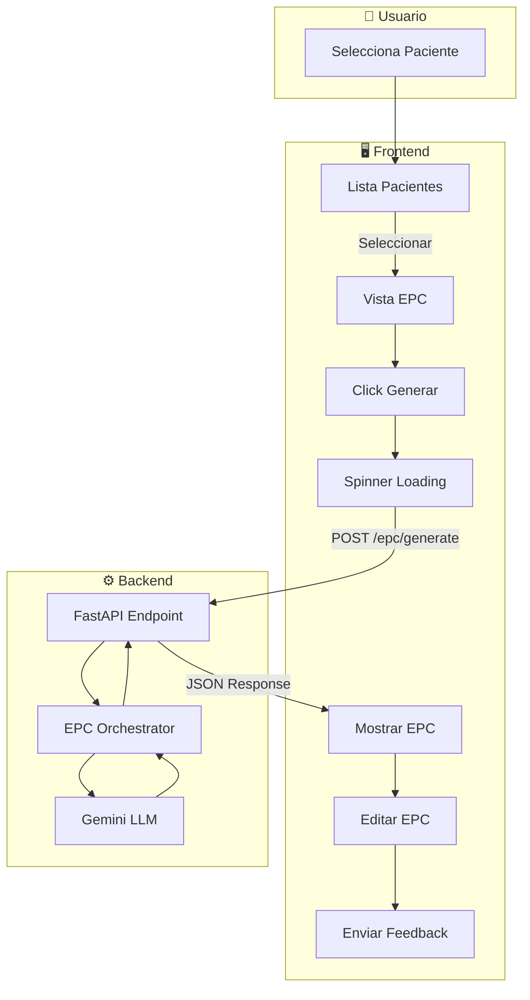
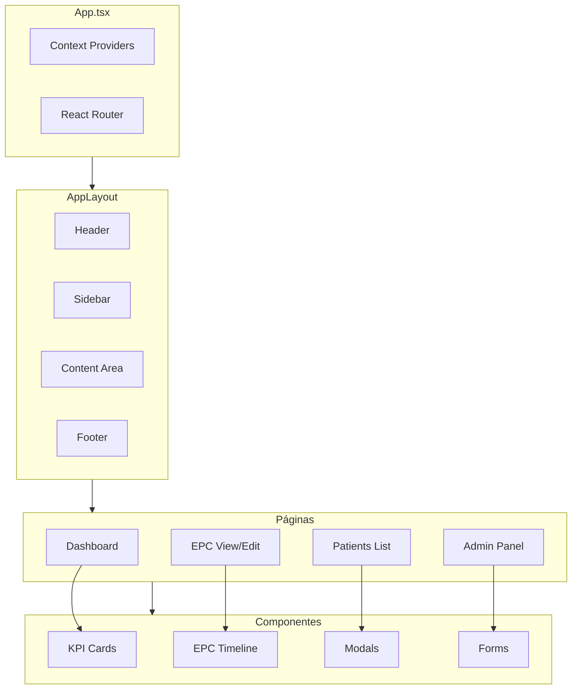

# 🖥️ AInstein Frontend - React + Vite

> Interfaz de usuario enterprise para la plataforma AInstein - Sistema de gestión de Epicrisis Clínicas con IA.

[](https://github.com/zeron-team/ainstein_fe)
[](https://react.dev)
[](https://vitejs.dev)
[](https://typescriptlang.org)

---

## 📋 Tabla de Contenidos

1. [Arquitectura del Frontend](#-arquitectura-del-frontend)
2. [Requisitos del Sistema](#-requisitos-del-sistema)
3. [Instalación Paso a Paso](#-instalación-paso-a-paso)
4. [Estructura del Proyecto](#-estructura-del-proyecto)
5. [Configuración](#-configuración)
6. [Rutas de la Aplicación](#-rutas-de-la-aplicación)
7. [Sistema de Diseño](#-sistema-de-diseño)
8. [Diagramas de Flujo](#-diagramas-de-flujo)
9. [Despliegue en Producción](#-despliegue-en-producción)
10. [Scripts Disponibles](#-scripts-disponibles)
11. [Troubleshooting](#-troubleshooting)

---

## 🏗️ Arquitectura del Frontend

```
┌─────────────────────────────────────────────────────────────────────┐
│                     AInstein Frontend v3.0.0                        │
├─────────────────────────────────────────────────────────────────────┤
│                                                                     │
│   ┌─────────────────────────────────────────────────────────────┐  │
│   │                      React 18.3 + Vite 5                    │  │
│   │  ┌─────────┐  ┌─────────┐  ┌─────────┐  ┌─────────────────┐│  │
│   │  │ Router  │  │  Auth   │  │  State  │  │  Design System  ││  │
│   │  │  v6.30  │  │ Context │  │  Local  │  │   CSS Tokens    ││  │
│   │  └─────────┘  └─────────┘  └─────────┘  └─────────────────┘│  │
│   └─────────────────────────────────────────────────────────────┘  │
│                                                                     │
│   ┌─────────────────────────────────────────────────────────────┐  │
│   │                        Páginas                              │  │
│   │  ┌──────┐ ┌──────────┐ ┌─────┐ ┌─────┐ ┌───────┐ ┌───────┐ │  │
│   │  │Login │ │Dashboard │ │ EPC │ │ HCE │ │Patients│ │ Admin │ │  │
│   │  └──────┘ └──────────┘ └─────┘ └─────┘ └───────┘ └───────┘ │  │
│   └─────────────────────────────────────────────────────────────┘  │
│                                                                     │
│   ┌─────────────────────────────────────────────────────────────┐  │
│   │                    Componentes                              │  │
│   │  ┌────────┐ ┌────────┐ ┌────────┐ ┌──────────┐ ┌──────────┐│  │
│   │  │ Layout │ │Sidebar │ │ Modal  │ │ Timeline │ │SystemFlow││  │
│   │  └────────┘ └────────┘ └────────┘ └──────────┘ └──────────┘│  │
│   └─────────────────────────────────────────────────────────────┘  │
│                                                                     │
│   ┌─────────────────────────────────────────────────────────────┐  │
│   │                      API Layer                              │  │
│   │            Axios ──► Backend FastAPI (port 8000)            │  │
│   └─────────────────────────────────────────────────────────────┘  │
│                                                                     │
└─────────────────────────────────────────────────────────────────────┘
```

### Stack Tecnológico

| Tecnología | Versión | Propósito |
|------------|---------|-----------|
| **React** | 18.3.1 | Framework UI |
| **Vite** | 5.4.10 | Build tool + Dev server |
| **TypeScript** | 5.6.3 | Tipado estático |
| **React Router** | 6.30.1 | Enrutamiento SPA |
| **Axios** | 1.7.4 | Cliente HTTP |
| **React Icons** | 5.5.0 | Iconografía |

---

## 💻 Requisitos del Sistema

### Software Requerido

| Requisito | Versión Mínima | Verificar con |
|-----------|----------------|---------------|
| **Node.js** | 18.0+ | `node --version` |
| **npm** | 9.0+ | `npm --version` |
| **Git** | 2.30+ | `git --version` |

### Backend Requerido

El frontend requiere el backend corriendo en `http://localhost:8000`.
Ver [ainstein_be README](https://github.com/zeron-team/ainstein_be) para instalación.

---

## 🚀 Instalación Paso a Paso

### Paso 1: Clonar el Repositorio

```bash
cd ~
git clone https://github.com/zeron-team/ainstein_fe.git
cd ainstein_fe
```

### Paso 2: Instalar Node.js (si no está instalado)

```bash
# Usando nvm (recomendado)
curl -o- https://raw.githubusercontent.com/nvm-sh/nvm/v0.39.7/install.sh | bash
source ~/.bashrc
nvm install 20
nvm use 20

# Verificar
node --version  # v20.x.x
npm --version   # 10.x.x
```

### Paso 3: Instalar Dependencias

```bash
npm install
```

### Paso 4: Configurar Variables de Entorno

```bash
# Crear archivo .env para desarrollo
cat > .env << 'EOF'
VITE_API_URL=http://localhost:8000
EOF
```

### Paso 5: Verificar que el Backend está Corriendo

```bash
curl http://localhost:8000/
# Debe responder: {"ok": true, "service": "EPC Suite"}
```

### Paso 6: Iniciar Servidor de Desarrollo

```bash
npm run dev
```

### Paso 7: Acceder a la Aplicación

Abrir en el navegador: **http://localhost:5173**

---

## 📁 Estructura del Proyecto

```
ainstein_fe/
├── 📄 .env                          # Variables desarrollo (NO commitear)
├── 📄 .env.production               # Variables producción
├── 📄 .gitignore
├── 📄 index.html                    # HTML base
├── 📄 package.json                  # Dependencias npm
├── 📄 package-lock.json
├── 📄 tsconfig.json                 # Configuración TypeScript
├── 📄 vite.config.ts                # Configuración Vite
├── 📄 README.md                     # Esta documentación
│
├── 📁 public/                       # Assets públicos (no procesados)
│   └── 📄 favicon.png
│
└── 📁 src/                          # ═══ CÓDIGO FUENTE ═══
    ├── 📄 main.tsx                  # Punto de entrada React
    ├── 📄 App.tsx                   # Componente raíz + providers
    ├── 📄 router.tsx                # Configuración de rutas
    ├── 📄 index.css                 # Estilos globales base
    ├── 📄 vite-env.d.ts             # Tipos Vite
    │
    ├── 📁 api/                      # ═══ CAPA API ═══
    │   └── 📄 axios.ts              # Instancia Axios configurada
    │                                 # - Base URL desde .env
    │                                 # - Interceptors JWT
    │                                 # - Error handling
    │
    ├── 📁 auth/                     # ═══ AUTENTICACIÓN ═══
    │   ├── 📄 AuthContext.tsx       # Context provider JWT
    │   │                             # - login(), logout()
    │   │                             # - user state
    │   │                             # - token management
    │   ├── 📄 PrivateRoute.tsx      # Guard rutas protegidas
    │   └── 📄 PublicRoute.tsx       # Guard rutas públicas (redirect si logueado)
    │
    ├── 📁 components/               # ═══ COMPONENTES REUTILIZABLES ═══
    │   │
    │   │   # ─── Layout ───
    │   ├── 📁 layout/
    │   │   ├── 📄 AppLayout.tsx     # Layout principal con sidebar
    │   │   ├── 📄 Header.tsx        # Cabecera con user info
    │   │   ├── 📄 Sidebar.tsx       # Barra lateral navegación
    │   │   ├── 📄 Footer.tsx        # Pie de página
    │   │   ├── 📄 layout.css
    │   │   └── 📄 sidebar.css
    │   │
    │   │   # ─── Core Components ───
    │   ├── 📄 KPI.tsx               # Tarjeta indicador KPI
    │   ├── 📄 kpi.css
    │   ├── 📄 EpcHistoryTimeline.jsx # Timeline versiones EPC
    │   ├── 📄 EpcHistoryTimeline.css
    │   ├── 📄 HelpModal.tsx         # Modal de ayuda
    │   ├── 📄 HelpModal.css
    │   │
    │   │   # ─── Feature Components ───
    │   ├── 📄 ImportHceModal.tsx    # 🆕 Modal importar HCE JSON
    │   ├── 📄 ImportHceModal.css
    │   │
    │   │   # ─── Visualization ───
    │   └── 📁 SystemFlow/           # 🆕 Diagrama flujo sistema
    │       ├── 📄 SystemFlowDiagram.tsx
    │       └── 📄 SystemFlowDiagram.css
    │
    ├── 📁 pages/                    # ═══ PÁGINAS/VISTAS ═══
    │   │
    │   │   # ─── Core Pages ───
    │   ├── 📄 Login.tsx             # Página login
    │   ├── 📄 Login.css
    │   ├── 📄 Dashboard.tsx         # Dashboard principal
    │   ├── 📄 dashboard.css
    │   ├── 📄 ErrorPage.tsx         # Página error 404
    │   │
    │   │   # ─── External Integration ───
    │   ├── 📄 AinsteinWsPage.tsx    # Integración WS HCE externo
    │   ├── 📄 AinsteinWsPage.css
    │   │
    │   │   # ─── Patients Module ───
    │   ├── 📁 Patients/
    │   │   ├── 📄 List.tsx          # Lista pacientes (paginada)
    │   │   ├── 📄 patients-list.css
    │   │   ├── 📄 Form.tsx          # Formulario crear/editar
    │   │   └── 📄 patient-form.css
    │   │
    │   │   # ─── EPC Module ───
    │   ├── 📁 EPC/
    │   │   ├── 📄 ViewEdit.tsx      # Ver/Editar/Generar EPC
    │   │   └── 📄 ViewEditEPC.css
    │   │
    │   │   # ─── Users Module ───
    │   ├── 📁 Users/
    │   │   ├── 📄 UsersCRUD.tsx     # CRUD usuarios
    │   │   └── 📄 UsersCRUD.css
    │   │
    │   │   # ─── Admin Module ───
    │   ├── 📁 Admin/
    │   │   ├── 📄 FeedbackDashboard.tsx   # Dashboard feedback IA
    │   │   ├── 📄 FeedbackDashboard.css
    │   │   ├── 📄 CostsDashboard.tsx      # Dashboard costos LLM
    │   │   ├── 📄 CostsDashboard.css
    │   │   ├── 📄 HealthCheck.tsx         # Estado servicios FERRO
    │   │   ├── 📄 HealthCheck.css
    │   │   ├── 📄 TenantManager.tsx       # 🆕 Gestión multi-tenant
    │   │   ├── 📄 TenantManager.css
    │   │   ├── 📄 EPCControlDashboard.tsx # 🆕 Control de EPCs
    │   │   ├── 📄 EPCControlDashboard.css
    │   │   ├── 📄 SnomedDashboard.tsx    # 🆕 SNOMED CT browser
    │   │   └── 📄 SnomedDashboard.css
    │   │
    │   │   # ─── Settings Module ───
    │   └── 📁 Settings/
    │       └── 📄 Branding.tsx      # Personalización marca
    │
    ├── 📁 styles/                   # ═══ ESTILOS GLOBALES ═══
    │   ├── 📄 tokens.css            # Variables CSS (Design System)
    │   ├── 📄 design-system.css     # 🆕 Utilidades y componentes base
    │   └── 📄 global.css            # Reset y estilos base
    │
    └── 📁 types/                    # ═══ TIPOS TYPESCRIPT ═══
        └── 📄 index.ts              # Interfaces compartidas
```

---

## ⚙️ Configuración

### Variables de Entorno

| Variable | Descripción | Ejemplo |
|----------|-------------|---------|
| `VITE_API_URL` | URL base del backend API | `http://localhost:8000` |

### Archivo `.env` (Desarrollo)

```env
VITE_API_URL=http://localhost:8000
```

### Archivo `.env.production` (Producción)

```env
VITE_API_URL=https://api.ainstein-epc.com
```

---

## 🗺️ Rutas de la Aplicación

### Rutas Públicas

| Ruta | Componente | Descripción |
|------|------------|-------------|
| `/login` | `Login.tsx` | Página de autenticación |

### Rutas Protegidas (requieren login)

| Ruta | Componente | Rol | Descripción |
|------|------------|-----|-------------|
| `/` | `Dashboard.tsx` | Cualquiera | Dashboard principal |
| `/patients` | `Patients/List.tsx` | Cualquiera | Lista de pacientes |
| `/patients/new` | `Patients/Form.tsx` | Cualquiera | Nuevo paciente |
| `/patients/:id/edit` | `Patients/Form.tsx` | Cualquiera | Editar paciente |
| `/epc/:patientId` | `EPC/ViewEdit.tsx` | Cualquiera | Ver/Editar/Generar EPC |
| `/ainstein` | `AinsteinWsPage.tsx` | Cualquiera | Integración WS HCE |

### Rutas Admin (requieren rol admin)

| Ruta | Componente | Descripción |
|------|------------|-------------|
| `/users` | `Users/UsersCRUD.tsx` | Gestión de usuarios |
| `/admin/feedback` | `Admin/FeedbackDashboard.tsx` | Dashboard feedback IA |
| `/admin/costs` | `Admin/CostsDashboard.tsx` | Costos LLM |
| `/admin/health` | `Admin/HealthCheck.tsx` | Estado servicios FERRO |
| `/admin/tenants` | `Admin/TenantManager.tsx` | Gestión multi-tenant |
| `/admin/epc-control` | `Admin/EPCControlDashboard.tsx` | 🆕 Control y monitoreo EPCs |
| `/admin/snomed` | `Admin/SnomedDashboard.tsx` | 🆕 Browser SNOMED CT |
| `/settings/branding` | `Settings/Branding.tsx` | Personalización |

---

## 🎨 Sistema de Diseño

### Design Tokens (tokens.css)

```css
:root {
  /* ═══════════════════════════════════════════════════════════════ */
  /* COLORES                                                         */
  /* ═══════════════════════════════════════════════════════════════ */
  
  /* Primarios */
  --color-primary: #0284c7;
  --color-primary-dark: #0369a1;
  --color-primary-light: #38bdf8;
  
  /* Estados */
  --color-success: #16a34a;
  --color-success-light: #22c55e;
  --color-warning: #d97706;
  --color-warning-light: #f59e0b;
  --color-danger: #dc2626;
  --color-danger-light: #ef4444;
  --color-info: #0891b2;
  
  /* Neutros */
  --color-bg: #f8fafc;
  --color-surface: #ffffff;
  --color-surface-elevated: #ffffff;
  --color-text: #1e293b;
  --color-text-secondary: #475569;
  --color-muted: #64748b;
  --color-border: rgba(148, 163, 184, 0.35);
  
  /* ═══════════════════════════════════════════════════════════════ */
  /* TIPOGRAFÍA                                                      */
  /* ═══════════════════════════════════════════════════════════════ */
  
  --font-family: 'Inter', system-ui, -apple-system, sans-serif;
  --font-family-mono: 'JetBrains Mono', 'Fira Code', monospace;
  
  --font-size-xs: 0.75rem;    /* 12px */
  --font-size-sm: 0.875rem;   /* 14px */
  --font-size-base: 1rem;     /* 16px */
  --font-size-lg: 1.125rem;   /* 18px */
  --font-size-xl: 1.25rem;    /* 20px */
  --font-size-2xl: 1.5rem;    /* 24px */
  --font-size-3xl: 1.875rem;  /* 30px */
  
  /* ═══════════════════════════════════════════════════════════════ */
  /* ESPACIADO                                                       */
  /* ═══════════════════════════════════════════════════════════════ */
  
  --spacing-xs: 0.25rem;   /* 4px */
  --spacing-sm: 0.5rem;    /* 8px */
  --spacing-md: 1rem;      /* 16px */
  --spacing-lg: 1.5rem;    /* 24px */
  --spacing-xl: 2rem;      /* 32px */
  --spacing-2xl: 3rem;     /* 48px */
  
  /* ═══════════════════════════════════════════════════════════════ */
  /* BORDES Y SOMBRAS                                                */
  /* ═══════════════════════════════════════════════════════════════ */
  
  --radius-sm: 8px;
  --radius-md: 14px;
  --radius-lg: 18px;
  --radius-xl: 24px;
  --radius-full: 999px;
  
  --shadow-sm: 0 4px 8px rgba(0, 0, 0, 0.06);
  --shadow-md: 0 10px 22px rgba(0, 0, 0, 0.08);
  --shadow-lg: 0 20px 40px rgba(0, 0, 0, 0.12);
  --shadow-glow: 0 0 20px rgba(2, 132, 199, 0.3);
  
  /* ═══════════════════════════════════════════════════════════════ */
  /* TRANSICIONES                                                    */
  /* ═══════════════════════════════════════════════════════════════ */
  
  --transition-fast: 150ms ease;
  --transition-normal: 250ms ease;
  --transition-slow: 400ms ease;
}
```

### Componentes Visuales

#### Cards
```css
.card {
  background: var(--color-surface);
  border-radius: var(--radius-md);
  box-shadow: var(--shadow-sm);
  padding: var(--spacing-lg);
}
```

#### Botones
```css
.btn-primary {
  background: var(--color-primary);
  color: white;
  border-radius: var(--radius-sm);
  padding: var(--spacing-sm) var(--spacing-md);
  transition: var(--transition-fast);
}

.btn-primary:hover {
  background: var(--color-primary-dark);
  box-shadow: var(--shadow-glow);
}
```

#### Status Badges
```css
.badge-success { background: var(--color-success-light); color: white; }
.badge-warning { background: var(--color-warning-light); color: white; }
.badge-danger { background: var(--color-danger-light); color: white; }
```

---

## 📊 Diagramas de Flujo

### Flujo de Autenticación



### Flujo de Generación de EPC



### Estructura de Componentes



---

## 🚀 Despliegue en Producción

### Opción A: Nginx (Recomendado)

#### 1. Compilar para producción

```bash
# Crear .env.production
echo "VITE_API_URL=https://api.ainstein-epc.com" > .env.production

# Compilar
npm run build
```

#### 2. Copiar archivos al servidor

```bash
scp -r dist/* user@server:/var/www/ainstein/
```

#### 3. Configurar Nginx

```nginx
# /etc/nginx/sites-available/ainstein-epc.com

server {
    listen 80;
    server_name ainstein-epc.com www.ainstein-epc.com;
    return 301 https://$server_name$request_uri;
}

server {
    listen 443 ssl http2;
    server_name ainstein-epc.com www.ainstein-epc.com;

    # SSL Certificates (Let's Encrypt)
    ssl_certificate /etc/letsencrypt/live/ainstein-epc.com/fullchain.pem;
    ssl_certificate_key /etc/letsencrypt/live/ainstein-epc.com/privkey.pem;

    # Root del frontend
    root /var/www/ainstein;
    index index.html;

    # SPA: todas las rutas van a index.html
    location / {
        try_files $uri $uri/ /index.html;
    }

    # Cache de assets estáticos
    location ~* \.(js|css|png|jpg|jpeg|gif|ico|svg|woff|woff2)$ {
        expires 1y;
        add_header Cache-Control "public, immutable";
    }

    # Proxy API al backend
    location /api/ {
        proxy_pass http://127.0.0.1:8000/;
        proxy_http_version 1.1;
        proxy_set_header Host $host;
        proxy_set_header X-Real-IP $remote_addr;
        proxy_set_header X-Forwarded-For $proxy_add_x_forwarded_for;
        proxy_set_header X-Forwarded-Proto $scheme;
        
        # SSE support
        proxy_set_header Connection '';
        proxy_buffering off;
        proxy_cache off;
    }

    # Security headers
    add_header X-Frame-Options "SAMEORIGIN" always;
    add_header X-Content-Type-Options "nosniff" always;
    add_header X-XSS-Protection "1; mode=block" always;
}
```

#### 4. Activar sitio

```bash
sudo ln -s /etc/nginx/sites-available/ainstein-epc.com /etc/nginx/sites-enabled/
sudo nginx -t
sudo systemctl reload nginx
```

### Opción B: PM2 + Vite Preview

```bash
# Instalar PM2
npm install -g pm2

# Build y servir
npm run build
pm2 start "npm run preview -- --host 0.0.0.0 --port 4173" --name ainstein-fe

# Guardar config PM2
pm2 save
pm2 startup
```

### Opción C: Docker

```dockerfile
# Dockerfile
FROM node:20-alpine as builder
WORKDIR /app
COPY package*.json ./
RUN npm ci
COPY . .
RUN npm run build

FROM nginx:alpine
COPY --from=builder /app/dist /usr/share/nginx/html
COPY nginx.conf /etc/nginx/nginx.conf
EXPOSE 80
CMD ["nginx", "-g", "daemon off;"]
```

```bash
docker build -t ainstein-fe .
docker run -d -p 80:80 ainstein-fe
```

---

## 📦 Scripts Disponibles

| Script | Comando | Descripción |
|--------|---------|-------------|
| `dev` | `npm run dev` | Servidor desarrollo con HMR (Hot Module Reload) |
| `build` | `npm run build` | Compilar para producción (→ `dist/`) |
| `preview` | `npm run preview` | Previsualizar build de producción |
| `lint` | `npm run lint` | Ejecutar ESLint |

### Ejemplos de Uso

```bash
# Desarrollo con red local
npm run dev -- --host 0.0.0.0

# Build con análisis de bundle
npm run build -- --mode analyze

# Preview en puerto específico
npm run preview -- --port 4000
```

---

## 🔗 Dependencias

### Producción

| Paquete | Versión | Propósito |
|---------|---------|-----------|
| `react` | 18.3.1 | Framework UI |
| `react-dom` | 18.3.1 | React DOM renderer |
| `react-router-dom` | 6.30.1 | Enrutamiento SPA |
| `axios` | 1.7.4 | Cliente HTTP |
| `react-icons` | 5.5.0 | Iconos |
| `classnames` | 2.5.1 | Utility clases CSS |

### Desarrollo

| Paquete | Versión | Propósito |
|---------|---------|-----------|
| `vite` | 5.4.10 | Build tool |
| `typescript` | 5.6.3 | Tipado estático |
| `@vitejs/plugin-react` | 4.3.3 | Plugin React para Vite |
| `@types/react` | 18.3.12 | Tipos React |
| `@types/react-dom` | 18.3.1 | Tipos React DOM |

---

## 🐛 Troubleshooting

| Problema | Solución |
|----------|----------|
| **`npm install` falla** | Borrar `node_modules` y `package-lock.json`, reinstalar |
| **Error CORS** | Verificar `VITE_API_URL` apunta al backend correcto |
| **Página en blanco** | Abrir DevTools → Console para ver errores |
| **Rutas no funcionan en producción** | Configurar Nginx con `try_files $uri /index.html` |
| **Build muy lento** | Verificar que `node_modules` no está en carpeta sincronizada |
| **HMR no funciona** | Verificar que Vite puede conectar a WebSocket (puerto 5173) |
| **Login no redirige** | Verificar que el backend devuelve token válido |
| **Imágenes no cargan** | Verificar rutas relativas vs absolutas |

### Verificar Conexión al Backend

```bash
# Desde el navegador, abrir DevTools → Network
# Hacer login y verificar que la petición a /auth/login:
# 1. Llega al backend correcto (VITE_API_URL)
# 2. Responde 200 con access_token
# 3. No hay errores CORS
```

### Limpiar Cache

```bash
# Limpiar cache de Vite
rm -rf node_modules/.vite

# Limpiar todo y reinstalar
rm -rf node_modules package-lock.json
npm install
```

---

## 🔄 Actualizar desde GitHub

```bash
# Obtener últimos cambios
git pull origin main

# Reinstalar dependencias (si cambiaron)
npm install

# Reconstruir (producción)
npm run build

# Copiar al servidor
scp -r dist/* user@server:/var/www/ainstein/
```

---

## 📚 Documentación Relacionada

- [Backend README](https://github.com/zeron-team/ainstein_be/blob/main/README.md) - Instalación del backend
- [CHECKLIST_SISTEMA.md](https://github.com/zeron-team/ainstein_be/blob/main/docs/CHECKLIST_SISTEMA.md) - Verificación completa

---

## 📄 Licencia

Propiedad de **Zeron Team** - Todos los derechos reservados.

---

*Última actualización: 2026-02-25 | AInstein Frontend v3.0.0*